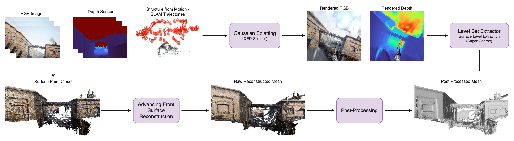

# Surf-LEAF

**Surf-LEAF** (Surface-Level Extraction with Advancing Front Reconstruction Meshing) is a custom mesh extraction pipeline tailored for **Gaussian Splatting** reconstructions in urban environments.



Gaussian Splatting is a recent point-based scene representation that enables real-time, high-fidelity novel view synthesis across large-scale scenes. While it excels in rendering, extracting high-quality meshes from Gaussian reconstructions remains a challenge—especially in urban scenes where sharp edges, low-contrast surfaces, and sparse regions can degrade mesh fidelity.

We demonstrate improved mesh quality over existing techniques like **DN-Splatter**, achieving a **10% reduction in Chamfer distance** on the TartanAir dataset.


## Table of Contents
- [Installation](#installation)
- [Usage](#usage)
- [Example](#example)

## Installation
Prerequisites:
- A working installation of [Nerfstudio](https://docs.nerf.studio/quickstart/installation.html)
- [QED-Splatter](https://github.com/leggedrobotics/qed-splatter/tree/normal_testing) or [DN-Splatter](https://github.com/maturk/dn-splatter/tree/main) for training Gaussian Splatting reconstructions.

1. Clone the repository and its submodules by running:

```sh
git clone https://github.com/Soldann/surf-leaf.git
cd surf-leaf
```

2. Load your nerfstudio conda environment:

```sh
conda activate nerfstudio
```

3. Install the package and its dependencies:

```sh
pip install -e .
```

## Usage
The `surf_leaf` package provides a command line interface to run the mesh extraction pipeline. The basic usage is as follows:

```sh
surf-leaf --load_config /<Path to your run>/config.yml
```

This will load the Gaussian Splatting reconstruction from the specified path and run the mesh extraction pipeline with default parameters.

A full table of parameters:

| Parameter | Type | Default              | Description |
|----------|------|----------------------|-------------|
| `load_config` | `Path` | REQUIRED             | Path to the trained config YAML file. |
| `output_dir` | `Path` | `"./mesh_exports/"`  | Path to the output directory. |
| `total_points` | `int` | `2_000_000`          | Total number of surface samples to extract. |
| `use_masks` | `bool` | `False`              | If dataset has masks, use them to restrict surface sampling. |
| `surface_levels` | `List[float]` | `[0.3]`              | Surface level isosurfaces to extract. |
| `return_normal` | `"analytical"`, `"closest_gaussian"`, `"average"` | `"closest_gaussian"` | Strategy for estimating normals from Gaussians. |
| `cropbox_pos` | `Optional[Tuple[float, float, float]]` | `None`               | Position of the cropbox center (x, y, z). |
| `cropbox_rpy` | `Optional[Tuple[float, float, float]]` | `None`               | Orientation of cropbox in roll, pitch, yaw (radians). |
| `cropbox_scale` | `Optional[Tuple[float, float, float]]` | `None`               | Scale (size) of the cropbox. |
| `voxel_size` | `float` | `0.4`                | Voxel size used during meshing. |
| `margin_seam` | `float` | `0.04`               | Seam margin used during meshing. |
| `margin_discard` | `float` | `0.04`               | Discard margin used during meshing. |
| `max_edge_length` | `float` | `1.0`                | Maximum triangle edge length in the mesh. |
| `postprocess_alpha_fraction` | `float` | `0.001`              | Alpha wrapping ball size fraction. |
| `postprocess_stepsmoothnum` | `int` | `1`                  | Number of HC Laplacian smoothing steps. |
| `postprocess_targetperc` | `float` | `0.6`                | Target reduction percentage for mesh simplification. |

## Example
For our example scene we use the [TartanAir](https://theairlab.org/tartanair-dataset/) dataset, specifically the `abandoned_factory/P001` scene.

We use [QED-Splatter](https://github.com/leggedrobotics/qed-splatter/tree/normal_testing) to train a Gaussian Splatting reconstruction of the scene.

After training, we can extract the mesh using Surf-LEAF:

```sh
surf-leaf --load_config /outputs/qed-splatter/2025-06-23_022015/abandoned_factory/P001/config.yml \
          --cropbox_scale 2.0, 2.0, 2.0
```

This will extract the mesh from the Gaussian Splatting reconstruction, using a cropbox scale of 2.0 in all dimensions.
The resulting mesh will be saved in the `mesh_exports` directory, with the name based on the scene and timestamp.

